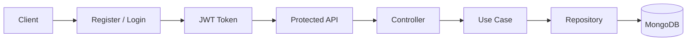

# 📑 API Reference

This document provides a complete reference for all APIs exposed by DevAssist.

All endpoints return JSON responses and follow a consistent response format.

---

# 📖 Table of Contents

- Base URL
- Authentication
- Response Format
- Error Responses
- Authentication APIs
- Endpoint APIs
- Request APIs
- Analytics APIs
- Status Codes

---

# 🌐 Base URL

Development

```
http://localhost:8030
```

Swagger Documentation

```
http://localhost:8030/docs
```

---

# 🔐 Authentication

Protected APIs require a JWT access token.

Include the token in the Authorization header.

```http
Authorization: Bearer <access_token>
```

---

# ✅ Standard Response Format

Successful responses

```json
{
    "success": true,
    "message": "Operation completed successfully",
    "data": {}
}
```

---

Error responses

```json
{
    "success": false,
    "message": "Error message"
}
```

---

# 🔑 Authentication APIs

---

## Register User

```http
POST /api/auth/register
```

Creates a new user account.

### Authentication

❌ Not Required

### Request Body

```json
{
    "name": "John Doe",
    "email": "john@example.com",
    "password": "password123"
}
```

### Success Response

```json
{
    "success": true,
    "message": "User registered successfully",
    "data": {
        "id": "...",
        "name": "John Doe",
        "email": "john@example.com"
    }
}
```

---

## Login

```http
POST /api/auth/login
```

Authenticates a user and returns a JWT.

### Authentication

❌ Not Required

### Request

```json
{
    "email": "john@example.com",
    "password": "password123"
}
```

### Success Response

```json
{
    "success": true,
    "message": "Login successful",
    "data": {
        "token": "<jwt-token>"
    }
}
```

---

## Get Current User

```http
GET /api/auth/me
```

Returns the authenticated user's profile.

### Authentication

✅ Required

---

# 🌐 Endpoint APIs

---

## Create Endpoint

```http
POST /api/endpoints
```

Creates a webhook endpoint for the authenticated user.

### Authentication

✅ Required

### Request

```json
{
    "name": "GitHub Webhook",
    "method": "POST"
}
```

---

## Get All Endpoints

```http
GET /api/endpoints
```

Returns all endpoints belonging to the authenticated user.

### Authentication

✅ Required

### Query Parameters

| Parameter | Description |
|-----------|-------------|
| page | Page number |
| limit | Results per page |
| search | Search by endpoint name |
| sortBy | Sort field |
| order | asc / desc |

---

## Get Endpoint

```http
GET /api/endpoints/:endpointId
```

Returns endpoint details.

Authentication

✅ Required

Ownership Validation

✅ Required

---

## Update Endpoint

```http
PATCH /api/endpoints/:endpointId
```

Updates endpoint information.

Authentication

✅ Required

Ownership Validation

✅ Required

---

## Delete Endpoint

```http
DELETE /api/endpoints/:endpointId
```

Deletes an endpoint.

Authentication

✅ Required

Ownership Validation

✅ Required

---

# 📨 Request APIs

---

## Receive Webhook

```http
POST /webhooks/:slug
```

Receives requests from third-party services.

Captured data includes:

- HTTP Method
- Headers
- Request Body
- Query Parameters
- Client IP
- Content Type
- Request Size
- Timestamp

Authentication

❌ Not Required

---

## Get Endpoint Requests

```http
GET /api/endpoints/:endpointId/requests
```

Returns captured requests for a webhook endpoint.

Authentication

✅ Required

Ownership Validation

✅ Required

Supports

- Pagination
- Search
- Filtering
- Sorting

---

## Get Request Details

```http
GET /api/requests/:requestId
```

Returns the complete request payload.

Authentication

✅ Required

Ownership Validation

✅ Required

---

# 📊 Analytics APIs

---

## Dashboard Analytics

```http
GET /api/analytics/dashboard
```

Returns overall statistics.

Authentication

✅ Required

### Response

Includes

- Total Endpoints
- Total Requests
- Requests Today
- Recent Requests
- Top Endpoints

---

## Endpoint Analytics

```http
GET /api/analytics/endpoints/:endpointId
```

Returns analytics for a specific endpoint.

Authentication

✅ Required

Ownership Validation

✅ Required

Returns

- Total Requests
- Requests Today
- Method Distribution
- Content-Type Distribution
- Daily Request Trend

---

# 🚨 HTTP Status Codes

| Code | Description |
|------|-------------|
| 200 | Success |
| 201 | Resource Created |
| 400 | Validation Error |
| 401 | Unauthorized |
| 403 | Forbidden |
| 404 | Resource Not Found |
| 409 | Conflict |
| 500 | Internal Server Error |

---

# 🔄 API Workflow



---

# 📝 Notes

- All protected endpoints require a valid JWT.
- Ownership validation prevents users from accessing resources they do not own.
- Pagination is available for list endpoints.
- Request validation is performed using Zod.
- Interactive API documentation is available via Swagger.