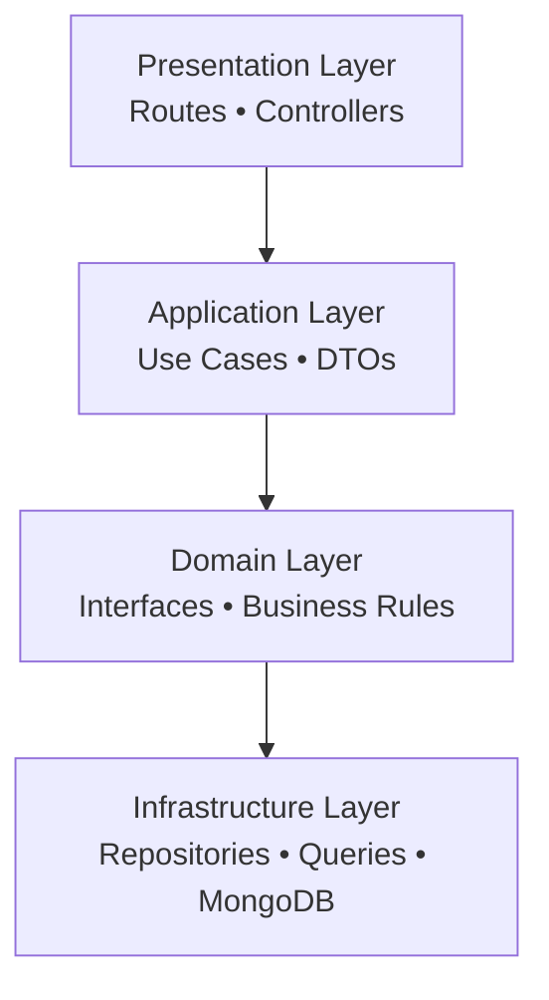
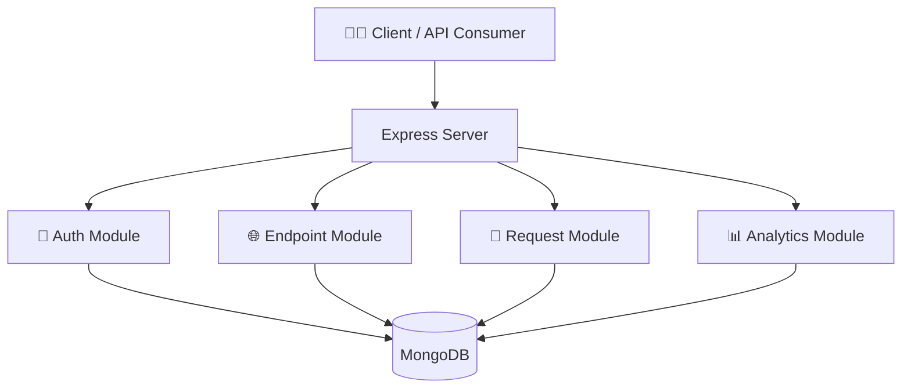
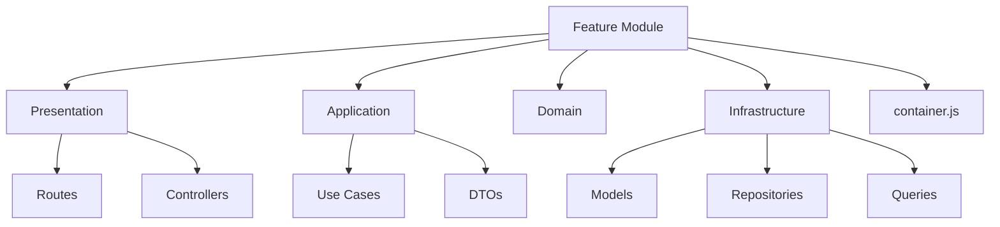
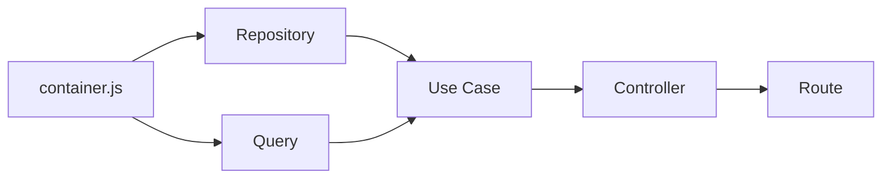
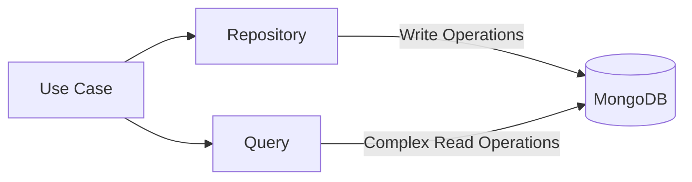
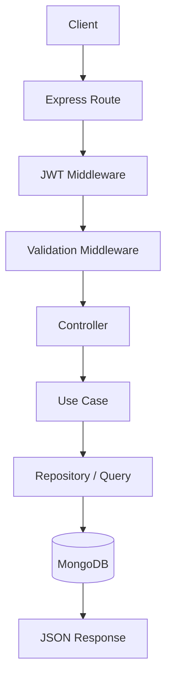
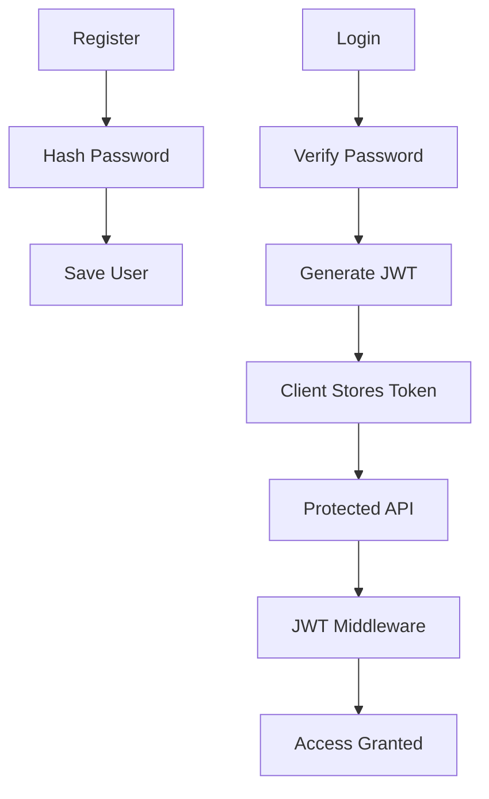
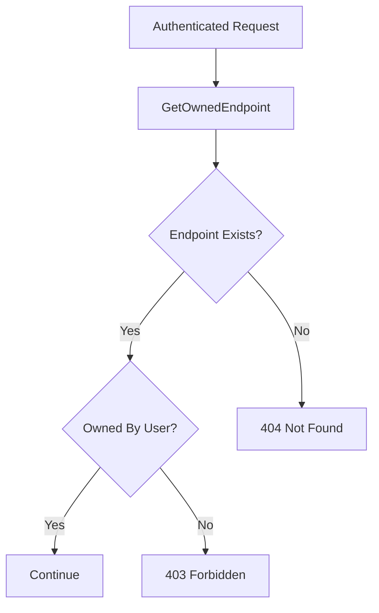
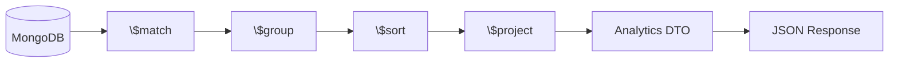
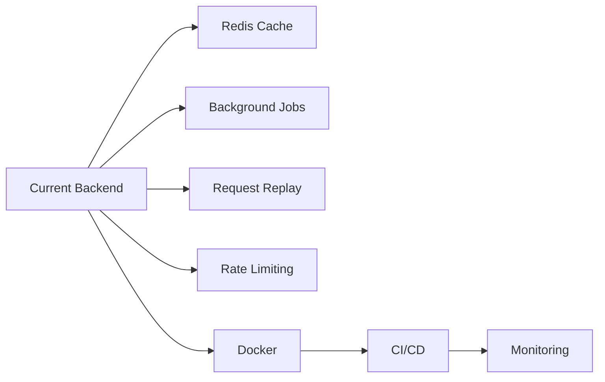

# 🏗️ DevAssist Architecture

DevAssist is built using a **Module-Based Clean Architecture**.

The primary goal of this architecture is to separate business logic from framework-specific code, making the application scalable, maintainable, and easy to test.

Unlike traditional Express applications where files are grouped by type (controllers, models, routes), DevAssist groups everything by **business feature**.

---

# 📖 Table of Contents

- Why Module-Based Architecture?
- Why Clean Architecture?
- High-Level System Architecture
- Module Structure
- Layer Responsibilities
- Dependency Injection
- Repository vs Query Pattern
- Request Lifecycle
- Authentication Flow
- Endpoint Authorization
- Analytics Pipeline
- Design Principles
- Scalability

---

# 🤔 Why Module-Based Architecture?

Many Express applications follow a structure like this:

```text
controllers/
models/
routes/
services/
middlewares/
```

Initially this works well, but as the application grows, every new feature requires changes across multiple folders.

For example, adding a new feature often means creating or modifying:

- Controllers
- Routes
- Models
- Services
- Validators
- Repositories

Related files become scattered across the project, making navigation difficult.

DevAssist solves this by organizing code around **business domains**.

```text
modules/

    auth/

    endpoints/

    requests/

    analytics/
```

Each module contains everything needed for that feature.

This approach provides:

- Better organization
- Easier maintenance
- Lower coupling
- Higher cohesion
- Independent feature development
- Better scalability

---

# 🏛️ Why Clean Architecture?

Clean Architecture separates business logic from implementation details.

Business rules should not depend on:

- Express
- MongoDB
- JWT
- Mongoose

Instead, frameworks become implementation details.

Benefits include:

- Easier testing
- Easier refactoring
- Framework independence
- Better separation of concerns
- Long-term maintainability

## 🧱 Clean Architecture



---

## 🌐 High-Level System Architecture



---

## 📦 Module Structure


---

# 🧱 Layer Responsibilities

## 🎯 Presentation Layer

Responsible for HTTP communication.

Contains:

- Routes
- Controllers
- Request Validation

Responsibilities:

- Receive requests
- Validate inputs
- Call use cases
- Return HTTP responses

The presentation layer **never contains business logic**.

---

## ⚙️ Application Layer

The application layer contains the business logic.

Examples:

```text
RegisterUser

LoginUser

CreateEndpoint

DeleteEndpoint

GetEndpointAnalytics

GetDashboardAnalytics

GetEndpointRequests
```

Each use case performs **one business operation**.

This makes the code easier to maintain, test, and reuse.

---

## 📘 Domain Layer

The domain layer defines business contracts.

Examples:

```text
UserRepository

EndpointRepository

RequestRepository
```

The domain layer contains no database or framework-specific code.

---

## 🗄️ Infrastructure Layer

Infrastructure contains implementation details.

Examples:

- MongoDB
- Mongoose
- Repository Implementations
- Query Objects

Only this layer communicates with MongoDB.

---

## 💉 Dependency Injection


---

## 🗄️ Repository vs Query Pattern



---

## Query Objects

Query objects are responsible for optimized read operations.

Examples:

- Dashboard Analytics
- Endpoint Analytics
- Request Search
- Pagination
- Aggregation Pipelines

This separation keeps repositories focused while allowing highly optimized database queries.

---

## 🔄 Request Lifecycle


---

## 🔐 Authentication Flow


---

## 🛡️ Endpoint Ownership Authorization


---

## 📊 Analytics Pipeline


---

# 🎯 Design Principles

The project follows several software engineering principles:

- Single Responsibility Principle (SRP)
- Separation of Concerns
- Dependency Inversion
- High Cohesion
- Low Coupling
- Feature-Based Organization
- Reusable Business Logic

These principles help keep the codebase maintainable as it grows.

---

## 🚀 Scalability Vision



Since each feature is isolated, new functionality can be introduced without major changes to the existing codebase.