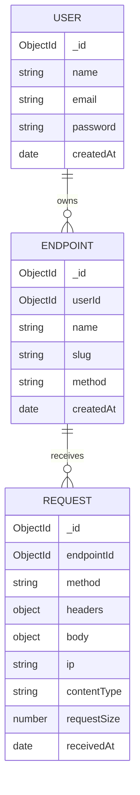
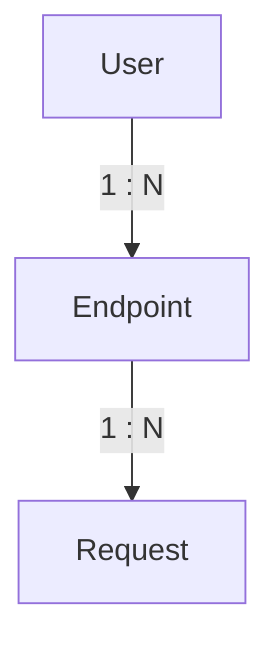
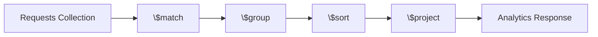

# 🗄️ Database Design

DevAssist uses **MongoDB** as its primary database and **Mongoose** as the ODM (Object Document Mapper).

The database is designed to support efficient webhook storage, analytics generation, and scalable request processing while keeping business entities clearly separated.

---

# 📖 Table of Contents

- Database Overview
- Entity Relationship Diagram
- Collections
- User Collection
- Endpoint Collection
- Request Collection
- Relationships
- Why Referencing Instead of Embedding?
- Query Strategy
- Indexing Strategy
- Future Improvements

---

# 🌐 Database Overview

The application consists of three primary collections.

- Users
- Endpoints
- Requests

Each collection has a single responsibility.



---

# 👤 User Collection

Stores registered users.

Typical fields

| Field | Type | Description |
|------|------|-------------|
| _id | ObjectId | Primary key |
| name | String | User name |
| email | String | Unique email |
| password | String | Hashed password |
| createdAt | Date | Registration timestamp |

Responsibilities

- Authentication
- User ownership
- JWT identity

---

# 🌐 Endpoint Collection

Represents webhook endpoints created by users.

Typical fields

| Field | Type | Description |
|------|------|-------------|
| _id | ObjectId | Primary key |
| userId | ObjectId | Owner |
| name | String | Endpoint name |
| slug | String | Public webhook identifier |
| method | String | Allowed HTTP method |
| createdAt | Date | Creation timestamp |

Responsibilities

- Webhook configuration
- Ownership validation
- Analytics grouping

---

# 📨 Request Collection

Stores every webhook request received.

Typical fields

| Field | Type | Description |
|------|------|-------------|
| _id | ObjectId | Primary key |
| endpointId | ObjectId | Related endpoint |
| method | String | HTTP method |
| headers | Object | HTTP headers |
| body | Object | Request payload |
| ip | String | Client IP |
| contentType | String | MIME type |
| requestSize | Number | Request size |
| receivedAt | Date | Timestamp |

Responsibilities

- Request inspection
- Analytics generation
- Debugging
- Replay support (future)

---

# 🔗 Relationships

The database follows a simple one-to-many relationship.



One user can create multiple webhook endpoints.

Each endpoint can receive thousands of webhook requests.

---

# 🤔 Why Referencing Instead of Embedding?

Instead of embedding requests inside an endpoint document, DevAssist stores them in a separate collection.

### Example (Not Used)

```json
Endpoint
{
    ...
    requests: [ ... thousands of objects ... ]
}
```

Problems:

- Large document size
- MongoDB document size limit (16 MB)
- Poor write performance
- Difficult pagination
- Expensive analytics

---

### Current Design

```text
Endpoint

↓

Request

↓

Request

↓

Request
```

Advantages

- Unlimited request history
- Better scalability
- Efficient pagination
- Faster writes
- Simpler analytics

---

# 🔍 Query Strategy

The application separates reads and writes.

### Write Operations

Handled by Repositories.

Examples

- Create Endpoint
- Update Endpoint
- Delete Endpoint
- Save Request

---

### Read Operations

Handled by Query Objects.

Examples

- Dashboard Analytics
- Endpoint Analytics
- Search
- Filtering
- Pagination

This keeps business logic simple while allowing highly optimized database queries.

---

# 📈 Aggregation Strategy

Analytics use MongoDB Aggregation Pipelines.



Aggregation allows MongoDB to compute statistics directly in the database, reducing memory usage in the application.

---

# ⚡ Indexing Strategy

To improve query performance, the following indexes are recommended.

## Users

```text
email (unique)
```

Reason

- Fast login
- Prevent duplicate accounts

---

## Endpoints

```text
slug (unique)
```

Reason

- Fast webhook lookup

---

```text
userId
```

Reason

- Quickly retrieve a user's endpoints

---

## Requests

```text
endpointId
```

Reason

- Fetch requests for an endpoint

---

```text
receivedAt
```

Reason

- Sort requests by newest first
- Time-based analytics

---

## Compound Indexes (Future)

```text
endpointId + receivedAt
```

Useful for

- Dashboard queries
- Request history
- Analytics

---

# 🚀 Future Database Improvements

As DevAssist evolves, several database optimizations are planned.

## Redis

Cache frequently accessed analytics.

Benefits

- Lower database load
- Faster dashboard responses

---

## TTL Indexes

Automatically remove old request logs.

Useful for

- Temporary webhook debugging
- Storage optimization

---

## Request Replay

Store replay metadata.

Examples

- Replay count
- Replay status
- Replay timestamp

---

## Sharding

If request volume becomes extremely large, requests can be sharded by endpoint or date.

This allows horizontal scaling across multiple MongoDB nodes.

---

# 🎯 Database Design Goals

The database design focuses on:

- Scalability
- Simplicity
- Fast writes
- Efficient analytics
- Clear relationships
- Easy maintenance

The separation of Users, Endpoints, and Requests keeps each collection focused on a single responsibility while supporting future growth without major schema changes.