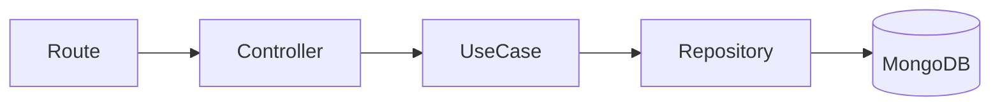

# 📂 Folder Structure

This document explains how DevAssist is organized and the responsibility of each folder.

The project follows a **Module-Based Clean Architecture**, where every feature owns its business logic, routes, infrastructure, and presentation layer.

---

# 📖 Table of Contents

- Root Structure
- Source Directory
- Modules
- Shared Components
- Configuration
- Middleware
- Module Anatomy
- Adding a New Feature

---

# 🌳 Root Structure

```text
devAssist/

├── docs/
├── src/
├── .env
├── .gitignore
├── package.json
├── README.md
└── LICENSE
```

| Folder/File | Purpose |
|-------------|---------|
| docs | Project documentation |
| src | Application source code |
| .env | Environment variables |
| package.json | Dependencies & scripts |
| README.md | Project overview |
| LICENSE | License information |

---

# 📁 Source Directory

```text
src/

├── config/
├── middleware/
├── modules/
├── shared/
├── app.js
└── server.js
```

---

## config/

Contains application configuration.

Examples

- MongoDB Connection
- Swagger Configuration
- Environment Configuration

Responsibilities

- Initialize external services
- Configure application-wide settings

---

## middleware/

Contains reusable Express middleware.

Examples

- Authentication Middleware
- Error Handler
- Validation Middleware

Responsibilities

- Authentication
- Authorization
- Error handling
- Request validation

---

## shared/

Contains reusable utilities shared across all modules.

Example structure

```text
shared/

├── constants/
├── helpers/
├── middleware/
├── errors/
├── utils/
└── swagger/
```

Typical contents

- APIError
- Response Helpers
- JWT Helpers
- Validation Utilities
- Constants
- Swagger Registry

Nothing inside this folder should belong to a single business feature.

---

# 📦 Modules

Every business feature is isolated inside its own module.

```text
modules/

├── auth/
├── endpoints/
├── requests/
└── analytics/
```

Benefits

- Better organization
- Easier maintenance
- Independent feature development
- Low coupling
- High cohesion

---

# 🧱 Anatomy of a Module

Every module follows exactly the same structure.

```text
module/

├── application/
├── domain/
├── infrastructure/
├── presentation/
└── container.js
```

---

## application/

Contains business logic.

```text
application/

├── dto/
└── use-cases/
```

### DTO

Responsible for shaping data between layers.

Examples

- RegisterDTO
- EndpointDTO

---

### Use Cases

Every business action has exactly one use case.

Examples

```text
RegisterUser

LoginUser

CreateEndpoint

DeleteEndpoint

UpdateEndpoint

GetDashboardAnalytics
```

The application layer should never know anything about Express or MongoDB.

---

## domain/

Contains business contracts.

Examples

```text
UserRepository

EndpointRepository

RequestRepository
```

The domain layer defines **what** is required, not **how** it is implemented.

---

## infrastructure/

Responsible for implementation details.

```text
infrastructure/

├── database/
├── models/
├── repositories/
└── queries/
```

### database/

Database configuration specific to the module.

---

### models/

Mongoose models.

Examples

```text
User.js

Endpoint.js

Request.js
```

---

### repositories/

Repositories handle write operations.

Examples

```text
MongoUserRepository

MongoEndpointRepository

MongoRequestRepository
```

---

### queries/

Optimized read operations.

Examples

```text
EndpointQuery

RequestQuery
```

Typical responsibilities

- Pagination
- Search
- Filtering
- Aggregation
- Reports

---

## presentation/

Responsible for HTTP.

```text
presentation/

├── controllers/
└── routes/
```

### Controllers

Receive HTTP requests.

Call use cases.

Return JSON responses.

Controllers should never contain business logic.

---

### Routes

Define API endpoints.

Attach middleware.

Map routes to controllers.

---

## container.js

Every module has a dependency injection container.

Example

```text
Repository

↓

Use Case

↓

Controller

↓

Route
```

The container wires everything together.

This avoids manually creating objects throughout the project.

---

# 🔄 Request Flow



Every module follows this exact flow.

---

# ➕ Adding a New Feature

Suppose we want to add a Notification module.

We simply create

```text
modules/

└── notifications/

    ├── application/

    ├── domain/

    ├── infrastructure/

    ├── presentation/

    └── container.js
```

No existing module needs to change.

This keeps the application scalable as new features are introduced.

---

# 📌 Design Guidelines

When contributing to DevAssist, follow these rules:

✅ Keep business logic inside Use Cases.

✅ Controllers should only handle HTTP.

✅ Repositories handle write operations.

✅ Query objects handle complex reads.

✅ Every module should expose a container.

✅ Avoid cross-module dependencies whenever possible.

✅ Shared utilities belong inside `shared/`.

---

# 🎯 Why This Structure?

This organization offers several advantages:

- Easier navigation
- Feature isolation
- Better scalability
- Reusable business logic
- Simplified testing
- Consistent project structure
- Lower maintenance cost

As the project grows, developers can work on individual modules with minimal impact on the rest of the codebase.