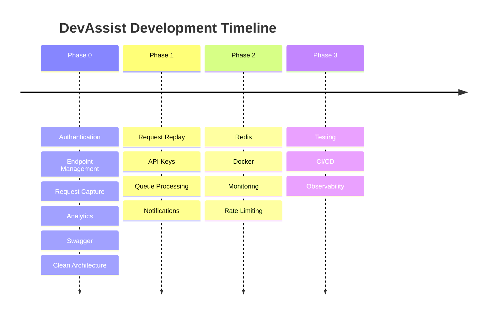

# 🛣️ DevAssist Roadmap

This document outlines the development journey of DevAssist.

Instead of building every feature at once, the project is developed in **phases**, with each phase focusing on delivering a stable and usable product before introducing more advanced capabilities.

---

# 🎯 Vision

DevAssist aims to become a developer-first platform for webhook inspection, request debugging, and API integration testing.

The long-term goal is to build a production-ready backend that demonstrates modern backend engineering practices while providing useful tooling for developers.

---

# 🗺️ Development Philosophy

Development follows an iterative approach.

Each phase focuses on three goals:

- Deliver a working feature set
- Maintain clean architecture
- Keep the codebase scalable for future enhancements

This ensures every milestone is usable and stable.

---

# ✅ Phase 0 — MVP (Current)

**Goal:** Build a secure and functional webhook inspection platform.

## 🔐 Authentication

- [x] User Registration
- [x] User Login
- [x] JWT Authentication
- [x] Get Current User

---

## 🌐 Endpoint Management

- [x] Create Endpoint
- [x] Get Endpoint
- [x] Get All Endpoints
- [x] Update Endpoint
- [x] Delete Endpoint
- [x] Endpoint Ownership Authorization

---

## 📨 Request Capture

- [x] Receive Incoming Webhooks
- [x] Store Request Headers
- [x] Store Request Body
- [x] Store Query Parameters
- [x] Store HTTP Method
- [x] Store Client IP
- [x] Store Content Type
- [x] Store Request Size
- [x] Store Timestamp

---

## 📊 Analytics

- [x] Dashboard Analytics
- [x] Endpoint Analytics
- [x] Request Trends
- [x] HTTP Method Distribution
- [x] Content-Type Distribution

---

## 🛠️ Developer Experience

- [x] Swagger Documentation
- [x] Zod Validation
- [x] Pagination
- [x] Search
- [x] Filtering
- [x] Sorting
- [x] Centralized Error Handling
- [x] Module-Based Clean Architecture
- [x] Dependency Injection
- [x] Repository Pattern
- [x] Query Pattern

---

# 🚀 Phase 1 — Developer Productivity

**Goal:** Make webhook debugging more powerful.

## Request Replay

- [ ] Replay captured requests
- [ ] Replay history
- [ ] Replay status tracking

---

## Endpoint Security

- [ ] API Keys
- [ ] Endpoint Secrets
- [ ] Secret Verification
- [ ] Signature Validation

---

## Background Processing

- [ ] Queue System
- [ ] BullMQ Integration
- [ ] Background Workers
- [ ] Retry Failed Jobs

---

## Notifications

- [ ] Email Notifications
- [ ] Replay Completion Alerts
- [ ] Failed Webhook Alerts

---

# ⚡ Phase 2 — Scalability & Performance

**Goal:** Improve performance and production readiness.

## Performance

- [ ] Redis Caching
- [ ] Response Caching
- [ ] Analytics Caching

---

## Security

- [ ] Rate Limiting
- [ ] Refresh Tokens
- [ ] IP Whitelisting
- [ ] Audit Logs

---

## Infrastructure

- [ ] Docker
- [ ] Docker Compose
- [ ] Environment Profiles

---

## Monitoring

- [ ] Health Check Endpoint
- [ ] Metrics Collection
- [ ] Prometheus Integration
- [ ] Grafana Dashboard

---

# 🏢 Phase 3 — Production Ready

**Goal:** Prepare DevAssist for real-world deployment.

## Quality

- [ ] Unit Tests
- [ ] Integration Tests
- [ ] API Tests

---

## CI/CD

- [ ] GitHub Actions
- [ ] Automated Testing
- [ ] Deployment Pipeline

---

## Documentation

- [ ] API Versioning
- [ ] Changelog
- [ ] Contribution Guide

---

## Observability

- [ ] Structured Logging
- [ ] Error Tracking
- [ ] Distributed Tracing

---

# 🌟 Future Ideas

Potential features beyond the current roadmap.

## Team Collaboration

- [ ] Teams
- [ ] Shared Workspaces
- [ ] Role-Based Access Control

---

## Integrations

- [ ] GitHub
- [ ] Slack
- [ ] Discord
- [ ] Zapier

---

## Developer Experience

- [ ] Request Comparison
- [ ] Request Diff Viewer
- [ ] Saved Filters
- [ ] Custom Dashboards

---

## AI Features

- [ ] AI-powered request summaries
- [ ] Request anomaly detection
- [ ] Payload validation suggestions
- [ ] API debugging assistant

---

# 📈 Progress Timeline

---

# 🎯 Project Goals

DevAssist is built to demonstrate practical backend engineering concepts, including:

- Scalable architecture
- Clean code organization
- REST API design
- Authentication & Authorization
- MongoDB data modeling
- Analytics using Aggregation Pipelines
- Dependency Injection
- Repository & Query patterns
- Production-oriented development practices

The roadmap reflects an incremental approach to building a backend system that can grow from a local development tool into a production-ready platform.